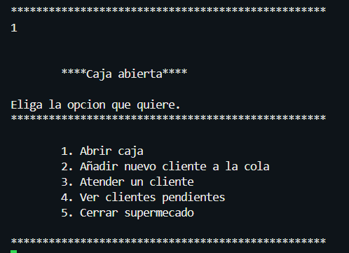

# Guia usuario

Para entender nuestro menu, primero debemos saber como funciona el sistema de colas (filas), donde la primera entidad en llegar/ingresar sera tambien la primera en ser afectada por un cambio externo. 

Mientras que sustancialemten las cestas de los clientes son pilas, osea. se amontonan los productos, siendo el primero en ingresar a la cesta sera el ultimo en ser afectado por un cambio externo. No podremos observar el comportamiento de este ni afectarlo mediante la interfaz, debido a que se generan de manera automatica.

## Opciones del Menú

1) *Abrir caja:* Abrira la caja y posibilitara el que los clientes puedan empezar filas y poder comprar su productos en cesta. Si la caja esta cerrada no habra interaccion entre ellos.

2) *Añadir un nuevo cliente a la cola:* Formara un cliente en la fila para ser atendido, se ordenaran por orden de llegada, siendo el primero el primero en ser atendido, si la caja esta cerrada no se atendera ninguno. Se recomiendo abrir la caja en tal caso.

3) *Atender un cliente:* Atendera al primer cliente en fila, de no haber clientes lo indicara.

4) *Ver los clientes pendientes:* Muestra los clientes que esten esperando en la cola. 

5) *Cerrar supermercado:* Se cerrara el supermercado, para poder hacerlo la caja debe cerrarse primero, y para cerrar la caja no deben haber clientes sin atender.

## Muestra grafica

#### opcion 1

#### opcion 2

El numero de productos y los productos son generados de manera aleatoria.

En caso de que no se haya abierto la caja lo alertara

#### opcion 3

atendera al cliente y se ira de la fila, se muestra la informacion del cliente que salio de la fila.

#### opcion 4

Muestra una lista de los clientes que siguen en fila

#### opcion 5

Cerrara la caja  y el supermercado de no haber mas clientes en la cola

si no hay clienets cierra todo.

[volver](../README.md)